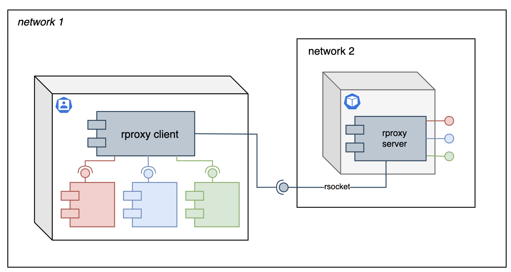

# RProxy 

RProxy is non-blocking TCP/IP proxy that is split into two parts - client and server, that allows to deploy each part on different subnets, allowing to expose normally not accessible hosts:



this allows to project local host into other networks and make locally deployed services available in remote cluster, e.g. expose local host in docker or kubernetes environment. 

## Comand Line Usage
Both server and client are packaged into a single [fat-jar](https://github.com/Azukovskij/rproxy/releases/tag/1.0.0), server can be started using `server` argument:
```
java -jar rproxy-1.0.0.jar server
```
and client using `client` argument respectively:
```
java -jar rproxy-1.0.0.jar client --proxy http://{proxy-host}:7878 --ports 8080 8081
```

Following command line options are supported:

| Appies To         | Option name      | Required |  Description                | 
| ----------------- | ---------------- | -------- | --------------------------- |
| server            | --port           | false  | Server port, defaults to 7878 |
| server, client    | --maxconnections | false  | Maximum number of concurrent connections to allow, defaults to 32 |
| client            | --proxy          | true   | Proxy server address          |
| client            | --ports          | true   | Ports to open on proxy server |

## Test Containers
Self configuring [testcontainer](https://testcontainers.com) implementation is provided in [ProxyContainer.java](https://github.com/Azukovskij/rproxy/blob/main/testcontainer/src/main/java/com/rproxy/ProxyContainer.java) that uses [azukovskij/rproxy](https://hub.docker.com/repository/docker/azukovskij/rproxy/general) docker image and allows to connect back to the test from started testcontainer, e.g. 
```
@Container
public ProxyContainer container = new ProxyContainer()
    .withProxiedPorts(List.of(8080));
```
will expose 8080 listened by test within the docker network.

### Kubernetes Integration
Testcontainers can be integrated to work on kuberenetes cluster using [kubedock](https://github.com/joyrex2001/kubedock) library that emulates docker API for testcontainer support.